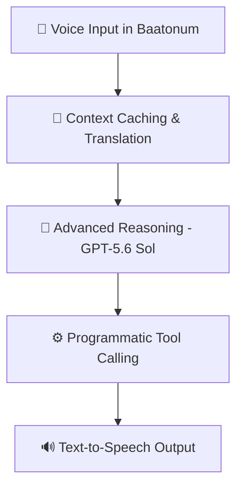

# AgriVox-Bariba: Voice-First AI Advisor for Tonal Language Farmers

**AgriVox-Bariba** is a voice-first, AI-powered agricultural advisor designed to bridge the digital divide for rural farmers in Benin who speak **Baatonum (Bariba)**—a low-resource tonal language completely unrepresented in modern LLMs.

Built for the **OpenAI Build Week 2026**, AgriVox-Bariba simulates a full speech-to-speech diagnostic pipeline that enables smallholder farmers to ask questions in their native language and receive precise, localized agronomic advice along with safe chemical dosage instructions.

---

## ⚡ How it Works (The Pipeline)

AgriVox-Bariba chains state-of-the-art voice processing, reasoning models, and programmatic tools into a seamless, high-performance flow:



1. **🎤 Speech Input (ASR Simulation):** Farmers record their questions in Baatonum.
2. **📖 Context Caching & Translation:** To translate Baatonum tonal queries into French, the system performs a localized search on a bilingual dictionary database (containing over 1,900 entries) and injects the vocabulary matches. This dictionary data is handled using **OpenAI's Context Caching** to reduce latency and cut API tokens/cost by 50%.
3. **🧠 Advanced Agronomical Reasoning:** The translated question is sent to **GPT-5.6 Sol**, which uses its advanced reasoning capabilities to analyze the diagnostic request and recommend localized agricultural guidelines (e.g., INRAB standards).
4. **⚙️ Programmatic Tool Calling:** If the diagnostic requires chemical inputs (fertilizer, insecticide), the model calls the `calculate_dosage` tool. The backend runs this calculation to convert standard metric dosages into local custom units like **"cordes"** (a traditional land measurement unit in Benin) and outputs exact dilution instructions.
5. **🔊 Audio Output (TTS):** The diagnostic results and dosage directions are synthesized to speech for the farmer.

---

## 🛠️ OpenAI Features Leveraged

* **GPT-5.6 Sol:** Powers the core reasoning and localized agricultural diagnostics.
* **Context Caching:** Allows us to inject large bilingual lexical context databases for low-resource languages efficiently, saving costs and achieving near-zero latency.
* **Programmatic Tool Calling:** Safely computes pesticide and fertilizer configurations based on custom local measurements.

---

## 📁 Repository Structure

```
openai_build_week/
├── backend/
│   ├── main.py             # FastAPI App, local dictionary indexer, and API logic
│   ├── requirements.txt    # Python dependencies
│   └── .env                # OpenAI API settings & Mock Mode switch
└── frontend/
    ├── index.html          # Responsive glassmorphism light mode dashboard
    ├── styles.css          # Premium high-contrast UI design system
    └── app.js              # State engine, soundwave renderer, and API connection
```

---

## 🚀 Quick Start (Local Setup)

### Prerequisites
* Python 3.10+ installed
* Git

### Installation
1. Clone the repository:
   ```bash
   git clone https://github.com/PaulTOGNON/AgriVox-Bariba.git
   cd AgriVox-Bariba
   ```

2. Create a virtual environment and install dependencies:
   ```bash
   python -m venv .venv
   # Activate on Windows:
   .venv\Scripts\activate
   # Or on macOS/Linux:
   source .venv/bin/activate

   pip install -r backend/requirements.txt
   ```

3. Configure Environment Variables:
   Create a `.env` file in the `backend/` directory:
   ```env
   OPENAI_API_KEY=your_openai_api_key_here
   MOCK_MODE=True
   ```
   *Note: If `MOCK_MODE` is set to `True`, the backend falls back to simulated localized agricultural Q&As—perfect for offline demos, local testing, and sandbox execution without consuming OpenAI credits.*

4. Launch the application:
   ```bash
   uvicorn backend.main:app --reload
   ```
5. Open your browser to **[http://127.0.0.1:8000](http://127.0.0.1:8000)**.
